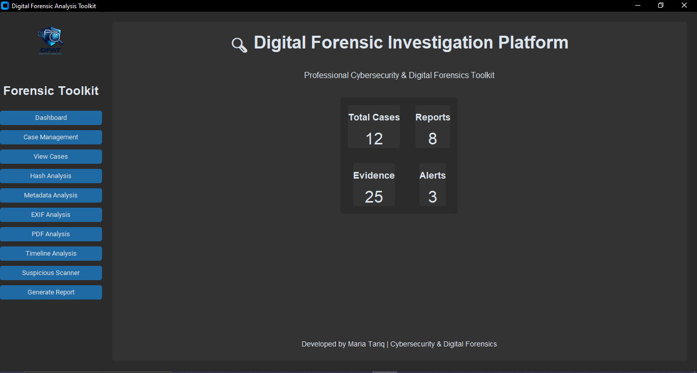
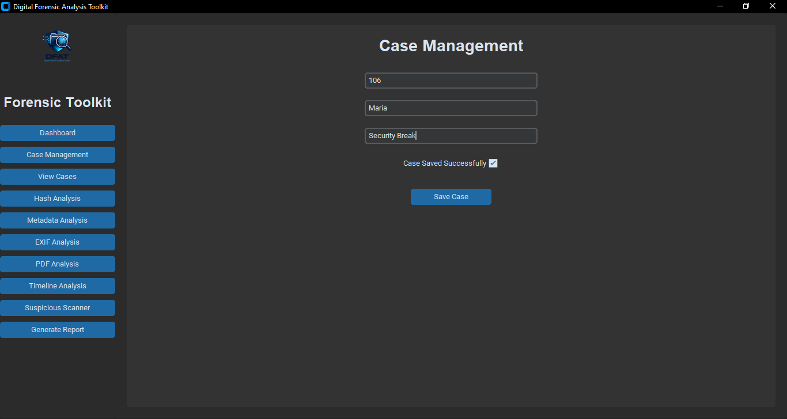
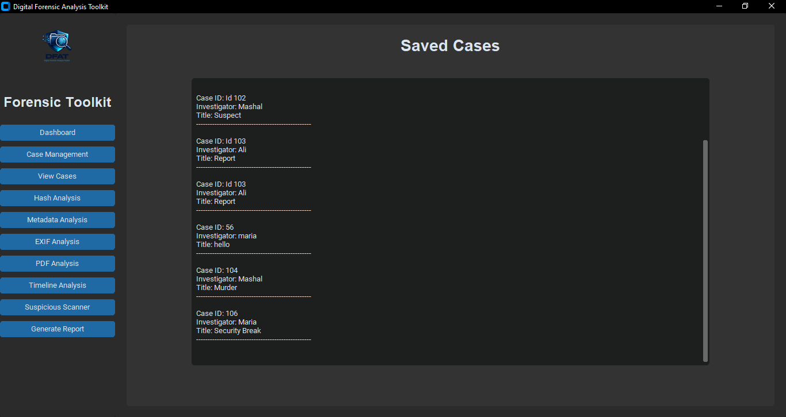
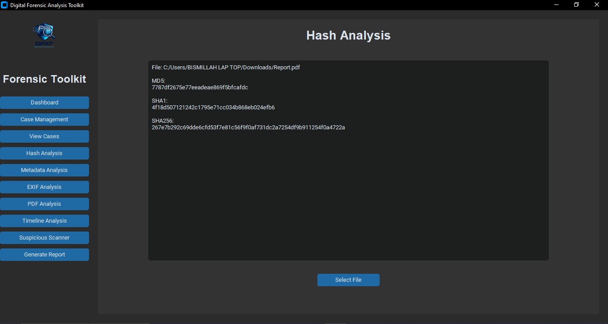
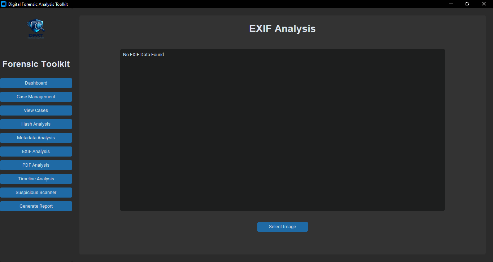
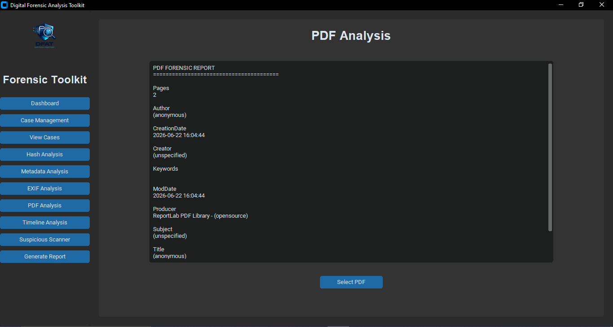
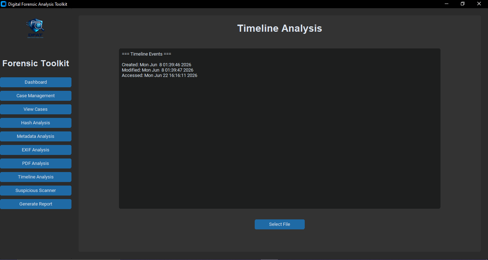
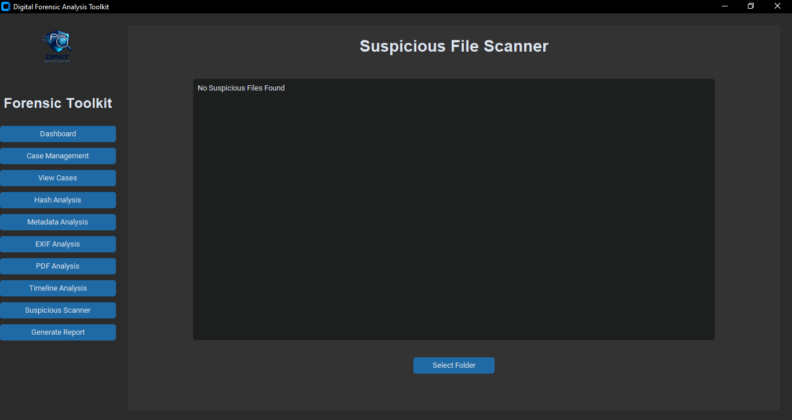
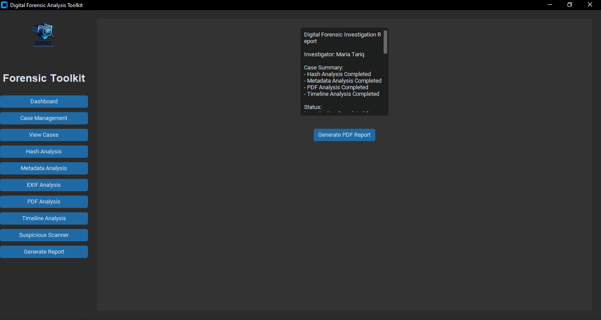

# 🔍 Digital Forensic Analysis Toolkit (DFAT)

A modern GUI-based Digital Forensic Investigation Toolkit developed in Python using CustomTkinter. This project provides investigators, students, and cybersecurity professionals with essential forensic analysis capabilities including file hashing, metadata extraction, EXIF analysis, PDF forensics, timeline analysis, suspicious file detection, case management, and professional report generation.

---

## 🚀 Features

### 📊 Dashboard

* Modern Cybersecurity Dashboard
* Professional Dark Theme Interface
* Investigation Statistics Overview
* Easy Navigation Panel

### 🗂 Case Management

* Create New Investigation Cases
* Store Case Information
* SQLite Database Integration
* View Previously Saved Cases

### 🔐 Hash Analysis

* MD5 Hash Generation
* SHA1 Hash Generation
* SHA256 Hash Generation
* File Integrity Verification

### 📁 Metadata Analysis

* File Name Detection
* File Size Analysis
* Creation Date Analysis
* Modification Date Analysis
* File Metadata Extraction

### 📸 EXIF Analysis

* Image Metadata Extraction
* Camera Information
* Image Resolution
* Date and Time Information
* EXIF Tag Investigation

### 📄 PDF Analysis

* PDF Metadata Investigation
* Author Information
* Creator Information
* Producer Information
* Page Count Analysis

### ⏳ Timeline Analysis

* File Creation Timeline
* File Modification Timeline
* File Access Timeline
* Evidence Activity Tracking

### ⚠️ Suspicious File Scanner

* Suspicious Extension Detection
* Potential Malware Indicators
* Rapid Evidence Scanning

### 📝 Professional Report Generator

* Automated PDF Report Generation
* Investigation Summary Creation
* Evidence Documentation
* Professional Forensic Reporting

---

## 🛠 Technologies Used

* Python 3.x
* CustomTkinter
* SQLite3
* Pillow
* ExifRead
* PyPDF2
* ReportLab
* Hashlib
* VS Code

---

## 📸 Project Screenshots

### 🔍 Dashboard



### 🗂 Case Management



### 📁 View Cases



### 🔐 Hash Analysis



### 📄 Metadata Analysis


### 📸 EXIF Analysis



### 📑 PDF Analysis



### ⏳ Timeline Analysis



### ⚠️ Suspicious File Scanner



### 📝 Report Generator



---

## 📂 Project Structure

```bash
Digital-Forensic-Analysis-Toolkit/
│
├── assets/
│   └── logo.png
│
├── database/
│   └── cases.db
│
├── forensic/
│   ├── case_manager.py
│   ├── metadata_analyzer.py
│   ├── exif_analyzer.py
│   ├── pdf_analyzer.py
│   ├── timeline_analyzer.py
│   ├── suspicious_scanner.py
│   └── report_generator.py
│
├── screenshots/
│   ├── dashboard.png
│   ├── case-management.png
│   ├── view-cases.png
│   ├── hash-analysis.png
│   ├── metadata-analysis.png
│   ├── exif-analysis.png
│   ├── pdf-analysis.png
│   ├── timeline-analysis.png
│   ├── suspicious-scanner.png
│   └── report-generator.png
│
├── modern_dashboard.py
├── requirements.txt
└── README.md
```

---

## ⚙️ Installation

### Clone Repository

```bash
git clone https://github.com/Maria-Tariq540/Digital-Forensic-Analysis-Toolkit.git
cd Digital-Forensic-Analysis-Toolkit
```

### Create Virtual Environment

```bash
python -m venv venv
```

### Activate Environment

```bash
venv\Scripts\activate
```

### Install Dependencies

```bash
pip install -r requirements.txt
```

### Run Application

```bash
python modern_dashboard.py
```

---

## 🎯 Learning Outcomes

This project demonstrates practical skills in:

* Digital Forensics
* Incident Investigation
* File Integrity Verification
* Metadata Analysis
* Evidence Management
* SQLite Database Operations
* GUI Development
* Python Programming
* Cybersecurity Reporting

---

## 👩‍💻 Author

**Maria Tariq**

Cybersecurity Enthusiast | Digital Forensics Learner | SOC & Blue Team Aspirant

GitHub: https://github.com/Maria-Tariq540

---

## ⭐ Future Improvements

* VirusTotal API Integration
* Malware Hash Lookup
* Evidence Chain of Custody Module
* File Signature Verification
* Network Forensics Module
* User Authentication System
* Advanced Reporting Dashboard

---

### ⚖️ Disclaimer

This project is developed for educational and cybersecurity learning purposes only.
